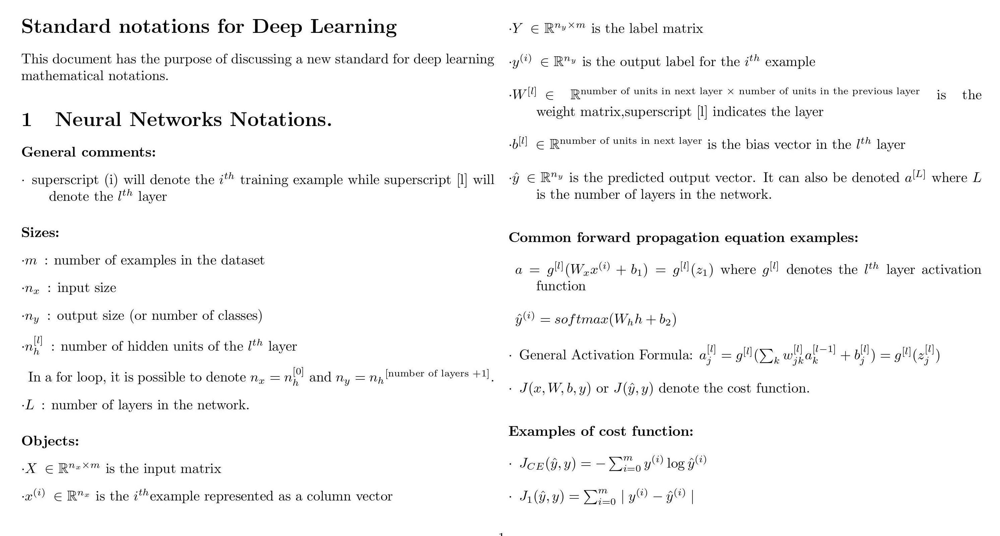
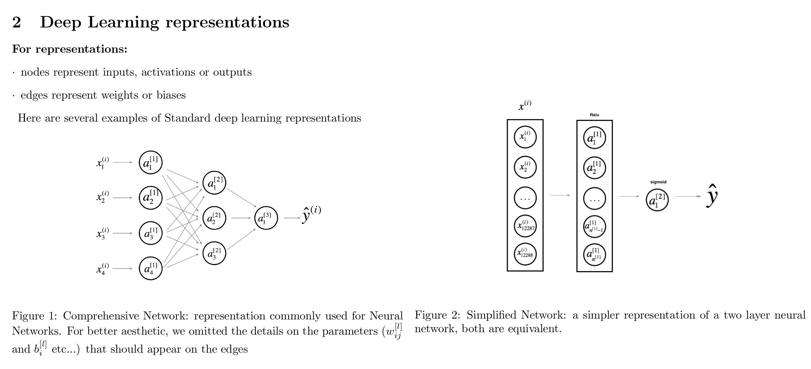

<h3>Intro to Deep Learning and Neural Network</h3>

Concepts used: 
 <ul>
  <li>Logistic Regression,</li>
  <li>Activation Functions,</li>
  <li>Forward Propagation,</li>
  <li>Backward Propagation,</li>
  <li>Vectorization,</li>
  <li>Gradient Descent(Optimization),</li>
  <li>Parameters and Hyperparameters</li>
 </ul>
 

<h4>Main Steps for Building a Neural Network</h4>

 1. Define the model structure such as number of input features.</ul>
 2. Initialize the model's parameters</ul>
 3. Loop:
        <ul>
        <li>Calculate current loss (Forward Propagation)</li>
        <li>Calculate curren gradient (Backward Propagation)</li>
        <li>Update parameters (Gradient Descent)</li>
        </ul>

<h4>Deep Learning Notations</h4>

